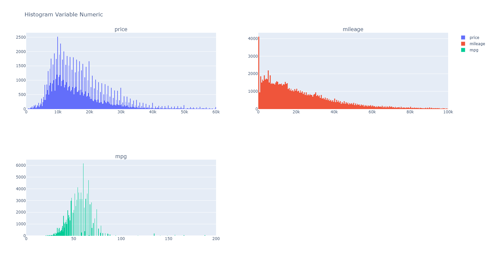
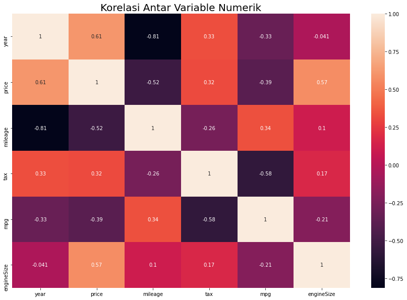
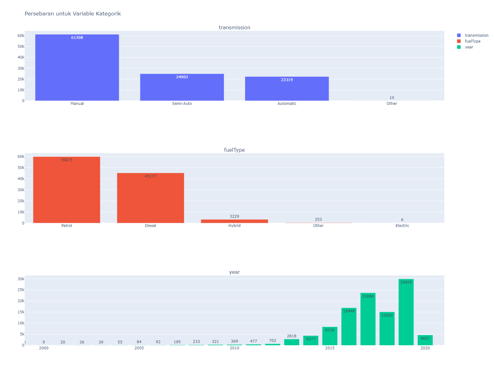
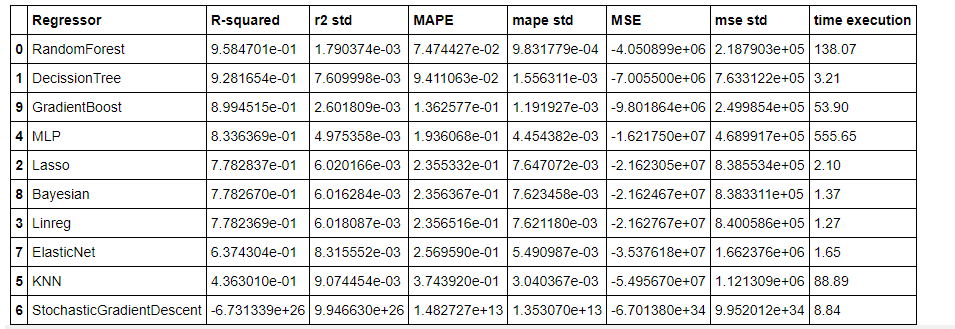
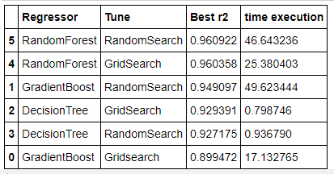

# ScikitLearnGroup_JC_DS_BDG_07_FinalProject
# **Business Understanding**

## **Business**  **and Problem Statement**

Saat ini terjadi perang harga di pasar mobil bekas. Sehingga pembeli menjadi lebih selektif dalam memilih mobil yang akan dibeli berdasarkan harga mobil yang telah dipasang. Maka dari itu penjual mobil perlu beradaptasi dengan pasar agar mobil dapat terjual dan tetap mendapatkan keuntungan dari hasil penjualan. Harga mobil yang terlalu tinggi dapat menyebabkan mobil tidak terjual dan untuk jangka panjangnya mobil seringkali kehilangan nilainya seiring berjalannya waktu.

Harga jual mobil dipengaruhi oleh beberapa faktor seperti merek, usia, dan spesifikasi mobil. Merek berpengaruh terhadap harga jual. Hal ini disebabkan oleh track record dari merek yang lebih terjamin kualitasnya. Usia mempengaruhi harga mobil disebabkan mobil karena usia berkaitan dengan frekuensi penggunaan mobil.

PWDK otomarket adalah perusahaan jual beli mobil yang ada di UK. Saat ini perusahaan hanya mematok harga jual dengan cara menambahkan 5% dari harga beli mobil tersebut. Dengan metode tersebut perusahaan berpotensi menerima kerugian disebabkan harga beli yang terlalu tinggi dibandingkan harga pasaran. Kami sebagai data scientist di PWDK otomarket ditugaskan untuk menentukan harga pasaran dari mobil berdasarkan brand, model, dan spesifikasi dari mobil.

## **Business Objectives**

Tujuan bisnis yang akan dicanangkan adalah sebagai berikut :

- Memprediksi harga mobil berdasarkan spesifikasi mobil.
- Menyediakan Informasi mengenai batas atas dan batas bawah dari harga mobil agar dapat meraih keuntungan namun masih bersaing dengan harga pasar.

## **Data Availability**

Data yang dimiliki hanya terbatas mobil yang dijual terlepas dari apakah mobil tersebut telah terjual maupun tidak. Kami akan menggunakan pola dari brand, model, dan spesifikasi mobil dengan harga jualnya untuk memprediksi harga jual mobil.

## **Analytic Approach**

Machine Learning dengan tipe Supervised Learning Regression menjadi metode kami untuk memprediksi harga mobil. Data yang sudah dibersihkan akan dibagi menjadi 3 yaitu : Data Train, Data Validation, dan Data Test. Nantinya Data Test akan diambil sebagian sebagai tolak ukur pengaruh model terhadap keuntungan perusahaan. Untuk pelatihan dan validasi akan diiterasi sebanyak 5 kali agar dapat mendapatkan hasil yang konsisten. Evaluasi dilakukan dengan membandingkan R Square antar model. Setelah diketahui model-model terbaik, akan dilakukan hyperparameter tuning dengan menggunakan 2 metode yaitu GridSearch dan RandomSearch agar dapat meraih hasil prediksi yang optimal.

Kekeliruan dalam prediksi dapat menyebabkan dampak seperti berikut :

- Ketika hasil prediksi yang dilakukan jauh dibawah harga pasar. Maka perusahaan berpotensi untuk kehilangan keuntungan karena sesungguhnya mobil dapat dijual dengan harga yang lebih tinggi.
- Ketika hasil prediksi yang dilakukan melebihi harga pasar. Maka mobil yang tersebut mempunyai peluang terjual yang sangat sedikit.

# **Data Understanding**

Kami menggunakan Dataset &quot;100,000 UK Used Car Data set&quot; yang ada di Kaggle. Dataset tersebut berisi data mobil yang dijual yang ada di UK dari tahun 1970 hingga 2020. Dataset tersebut mempunyai 9 variabel termasuk 1 label &quot;price&quot; di dalamnya. Berikut adalah detail dari variabel yang ada :

| **Attribute** | **Data Type** | **Description** |
| --- | --- | --- |
| brand | string | Nama brand mobil. |
| model | string | Model dari brand terkait. |
| year | interger | Tahun pembuatan mobil. |
| transmission | string | Jenis transmisi yang digunakan mobil. |
| mileage | interger | Jarak tempuh mobil. |
| fueltype | string | Jenis bahan bakar yang dibutuhkan mobil. |
| enginesize | float | Ukuran mesin dalam liter (L) |

Dan berikut adalah rincian dari label dataset :

Nama : price  
Tipe Data : float  
Deskripsi : Harga mobil satuan.

# **EDA**
## **Data Distribution Plot**
1. Terlihat dari grafik berikut, bahwa distribusi kolom price, mileage, dan mpg berbentuk right-skewed.  
2. Untuk variable milage, terdapat nilai dominan mendekati 0 yang berarti mobil tersebut termasuk baru atau hampir tidak pernah digunakan.  

## **Correlation**
1. Terdapat korelasi yang cukup signifikan (dalam bentuk negatif) antara variable mileage dan juga variable year. Yang mana berarti jarak tempuh yang semakin jauh apabila tahun rilis mobil semakin kecil.  
2. Ada 2 variable yang berpengaruh terhadap variable price yaitu variable year dan juga variable engineSize. Kedua variable tersebut mempunyai korelasi positif terhadap variable price.

## **Categoric Variable Countplot**
1. Transmisi manual masih menjadi unit mobil yang dijual paling banyak. Dibawahnya ada dua tipe transmisi yang memiliki jumlah unit yang tidak begitu jauh yaitu semi-auto dan juga automatic.  
2. Untuk variable fuelType, Petrol dan Diesel menjadi jenis bahan bakar terbanyak jauh meninggalkan hybrid dan electric.
3. Pada setiap tahun rilis, jumlah mobil yang dijual mengalami peningkatan, namun pengecualian untuk tahun 2018 yang mengalami penurunan dari tahun sebelumnya.

## **Identify Missing Values, Duplicates, and Outlier**
1. Terdapat data duplikat sebanyak blabla data.
2. Terdapat missing Value sebanyak blablabla data pada kolom tax dan mpg pada model Focus dan C Class.
3. Terdapat anomali data pada variable tertentu.
4. Terdapat outlier pada beberapa variable namun kami memutuskan untuk tidak menghapus data tersebut dikarenakan kami menilai ada informasi penting pada data tersebut.

# **Data Preprocessing**
## **Drop Dupplicate**
1. Menghapus row data yang duplikat untuk seluruh variable kecuali untuk model Focus dan C Class.
2. Menghapus row data yang duplikat untuk variable selain tax dan mpg untuk model Focus dan C Class.

## **Handling Anomaly Data**
1. Menghapus data tertentu yang memiliki tahun rilis yang tidak realistis.
2. Menghapus data yang memiliki mpg yang tidak realistis.
3. Mengganti nilai engineSize yang bernilai 0 kecuali untuk mobil yang berbahan bakar Hybrid dan Electric.

## **Handling Missing Value**
1. Mengganti nilai missing value pada tax dengan nilai median dari mobil yang memiliki model dan tahun yang sama.
2. Mengganti nilai missing value pada mpg dengan median dari mobil yang memilki model dan jenis bahan bakar yang sama.

# **Machine Learning Modelling and Analysis**
## **Regression Algorihm**

Pada awalnya, kami memilih 10 metode regresi :
1. Linear Regreesion
2. Multilayer Perceptron Regression
3. Gradientboost Regression
4. Random Forest Regression
5. Decision Tree Regression
6. KNN Regression
7. Stochastic Gradient Descent Regression
8. ElasticNet Regression
9. Lasso Regression
10. Bayesian Regression

Berikut adalah hasil evaluasi dari kebaikan model secara default :

Dari tabel tersebut, diambil 3 model terbaik berdasarkan nilai R Squared terbesar. Model yang dipilih adalah Random Forest, Decision Tree, dan Gradient Boost Regressor.

## **Hyperparameter Tuning**
Dari ketiga model tersebut, dilakukan tuning dengan menggunakan parameter tertentu. Pada masing-masing model dilakukan 2 metode hyperparameter tuning yaitu GridSearch dan RandomSearch. Berikut adalah hasil evaluasi dari Hyperparameter Tuning yang telah dilakukan :  

Dari tabel diatas. diketahui bahwa model Random Forest dengan metode tuning RandomSearch mempunyai nilai R Squared yang terbesar. Sehingga metode tersebut kami pilih sebagai model final untuk memprediksi harga mobil.

## **Model Test Evaluation**
1. Dari model final, dilakukan pengujian pada data Test dan menghasilkan nilai R Squared sebesar 96%.
2. Dari hasil prediksi, kita dapat menentukan batas bawah dan juga batas atas harga jual mobil.
3. Dari nilai prediksi tersebut, dapat dihitung juga keuntungan minimum dan maksimum yang dapat diperoleh dari pembelian mobil.

# **Conclusion**

  1. Data merupakan penjualan mobil pada sebuah platform.
  2. Proses cleaning yang dilakukan menghasilkan data sebanyak 98385
  3. Dilakukan untuk mengetahui pola dari data mobil yang dijual
  4. Untuk menghasilkan prediksi yang baik dilakukan seleksi model menggunakan R-squared sebagai acuan.
  5. Model terbaik menghasilkan R-squared sebesar 96% 

# **Business Impact**
Hasil pembelian mobil diharapkan dapat dijual kembali sesuai dengan harga pasar yang telah dimodelkan dari analisis yang telah dilakukan. Dari hasil jual kembali mobil maka perusahaan diharapkan dapat meningkatkan keuntungan dari yang hanya berkisar 5% menjadi 6% hingga 18%.
